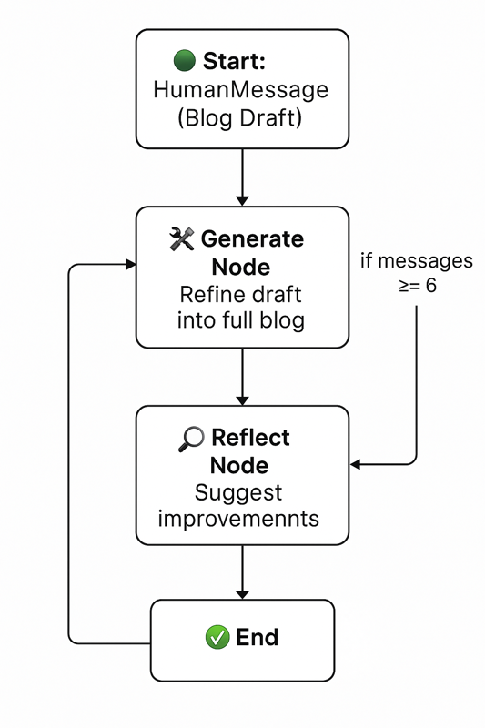

# LangGraph Blog Refiner

LangGraph Blog Refiner is an AI-powered tool that refines and improves blog posts from Medium using a multi-step agent loop built with [LangGraph](https://github.com/langchain-ai/langgraph) and LangChain. This project reads a Medium article, generates a refined version, and iteratively improves it through a reflection loop.



## Features

- 🔍 Fetches blog content from Medium.
- 🧠 Uses LangChain chains for generation and reflection.
- 🔁 Loops until the blog post reaches a refined state.
- ✅ Stops automatically after a number of iterations or a condition is met.

## Project Structure

- `main.py`: Entry point and orchestration logic using LangGraph.
- `chains.py`: Defines the generation and reflection chains.
- `medium_utils.py`: Utility to extract content from Medium articles.

## Installation

### Prerequisites

- Python 3.9+
- [Poetry](https://python-poetry.org/) installed

### Steps

1. Clone this repository:
   ```bash
   git clone https://github.com/your-username/langgraph-blog-refiner.git
   cd langgraph-blog-refiner
   ```

2. Install dependencies:
   ```bash
   poetry install
   ```

3. (Optional) Create a `.env` file in the root directory if any environment variables are required.

## Usage

Run the project with Poetry:

```bash
poetry run python main.py
```

You'll see a graph diagram and the final refined blog post printed in the console.

## Example Output

```
🟢 Running LangGraph Blog Refiner...

✅ Final Improved Blog Post:

[Refined content here]
```

## Development

To activate the Poetry shell for interactive development:

```bash
poetry shell
```

## License

MIT License

## Acknowledgements

- [LangGraph](https://github.com/langchain-ai/langgraph)
- [LangChain](https://github.com/langchain-ai/langchain)
- [Medium](https://medium.com)